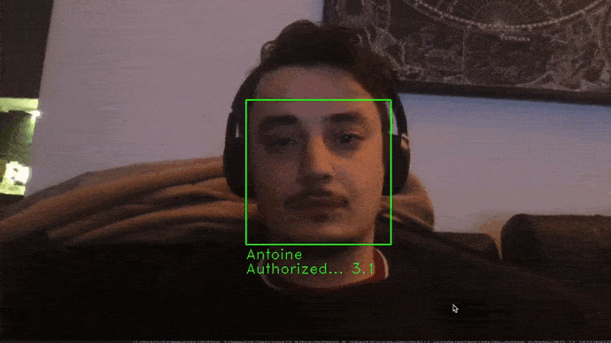

# Facial Authentification

[](https://opensource.org/licenses/MIT) [](https://svgshare.com/i/ZjP.svg)

Own facial authentification (on macOS) in 10 minutes with laptop locking and voice assistant. 

Quick intro: [Slides presentation](https://gruz77.github.io/facial_auth/#/Home)

---

## Facial recognition
Using the simple [facial_recognition](https://github.com/ageitgey/face_recognition) library.

## Laptop locking
Just put the following magic elvish command (applescript) in a python script and your laptop (macOS) will be locked:
```python
import os
os.system("osascript -e 'tell app \"loginwindow\" to  «event aevtrlgo»'")
```

## Voice assistant (Text-to-Speech)
Using the simple [pyttsx3](https://github.com/nateshmbhat/pyttsx3) offline library, which uses the driver.
Can select language and gender. 

## Task Manager
Quicly, you can create an application ".app" (macOS) with [Automator](https://support.apple.com/fr-ne/guide/automator/welcome/mac) (already installed) and then schedule the task with [EventScripts](https://www.mousedown.net/software/EventScripts.html) (but now it has become a paid service... so why not [cron jobs at reboot](https://phoenixnap.com/kb/crontab-reboot)?)

---


